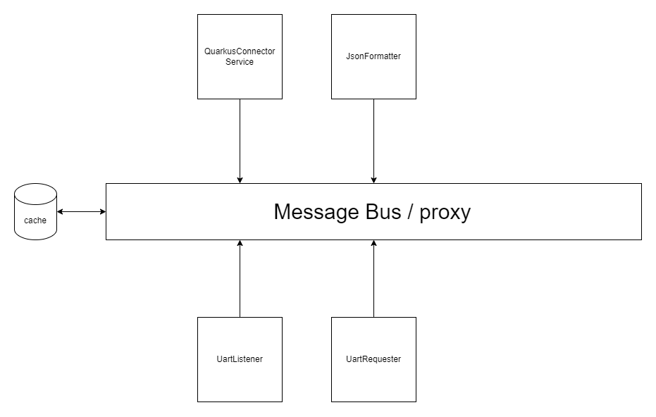

# SnowLift Tracker iot-gateway

## Change Log
| Version|    Date    | Edited by          | Description |
| :---   |   :----:   | :----              | :---         | 
| v1.0.0 | 10/01/2024 | LABD               | Creation |
| v1.1.0 | 15/01/2024 | LABD               | Update + rephrase |

## Table of Content

[[_TOC_]]

## In this document

Welcome to the IoT Gateway of the SnowLift Tracker project! This component plays a crucial role in collecting data from the iot-nodes and forwarding it to the backend. In this document, you'll find information on the Raspberry Pi 3B+ board, the architecture of the IoT Gateway, and how to build this part of the project.

## Raspberry Pi 3B+


### Board Overview

Our IoT Gateway utilizes the Raspberry Pi 3B+ for its robust performance and compatibility with various environments. Below are some key features of the Raspberry Pi 3B+:

- **Processor:** Quad-core 64-bit ARM Cortex-A53
- **Memory:** 1GB RAM
- **Connectivity:** Ethernet, Wi-Fi, Bluetooth
- **GPIO Pins:** 40 GPIO pins for sensor and peripheral connections
- **USB Ports:** 4 USB 2.0 ports for additional devices
- **Operating System:** Raspbian (or your preferred distribution)

### Setup Instructions

1. **Hardware Setup:**
   - We need to connect GPIO pin 14, 15, and a ground to our iot-node. 
   - Ensure the Raspberry Pi is Ethernet port is in static.

2. **Software Setup:**
   - Git is installed. 
   - You may need to install some dependencies like `czmq` or `curl`.

3. **Configuration:**
   - Configure the IoT Gateway settings, such as the backend server address in the `QuarkusConnectore` service. 

4. **Additional Resources:**

   - [Official Raspberry Pi Foundation Website](https://www.raspberrypi.org/)
   - [Official Documentation](https://www.raspberrypi.org/documentation/)


## Architecture

The IoT Gateway utilizes a message bus-based architecture consisting of two main services, QuarkusConnector and UartListener, orchestrated through a Proxy service. This modular design ensures efficient communication between the IoT Node and the backend, enabling data flow and processing.

Here is a diagramme of the wanted architecture :



### Components Overview

1. **QuarkusConnector Service:**
   - **Responsibility:** Receives serialized data from the message bus, transforms it into JSON, and forwards it to the SnowLift Tracker backend.
   - **Details:**
     - Listens to the message bus for incoming data.
     - Formats the received data into JSON for compatibility with the backend.
     - Establishes a connection with the backend to transmit the processed data.

2. **UartListener Service:**
   - **Responsibility:** Listens for incoming data from the IoT Node via Uart communication, serialize it, and forwards it to the message bus.
   - **Details:**
     - Monitors the Uart interface for data from the IoT Node.
     - Serialize the received data into a standardized format suitable for the message bus.
     - Sends the serialized data to the message bus.

3. **Proxy (Message Bus):**
   - **Responsibility:** Listens to data from UartListener and forward them to QuarkusConnector. 
   - **Details:**
     - Acts as a central hub, receiving/publishing messages from/to both services.
     - Forward incoming messages.
     - Orchestrates the flow of data between QuarkusConnector and UartListener.

### Message Flow

The message flow within the IoT Gateway is as follows:

1. **Data Ingestion:**
   - UartListener receives raw sensor data from the IoT Node via Uart communication.
   - The received data is serialized and sent to the Proxy (Message Bus).

2. **Proxy Operations:**
   - The Proxy receives data from UartListener.

3. **QuarkusConnector Interaction:**
   - QuarkusConnector subscribes to the Proxy for serialized data.
   - The Proxy forwards the formatted data to QuarkusConnector.

4. **Backend Transmission:**
   - QuarkusConnector transforms the data into JSON.
   - The formatted data is securely transmitted to the SnowLift Tracker backend.

### Future Enhancements

The architecture is designed to be extensible. Future enhancements may include:

- **Caching Mechanism Implementation:** Set the caching mechanism within the Proxy for optimized data retrieval.
- **Additional Services:** Integrate new services for specific functionalities or sensor types.
- **Dynamic Message Formatting:** Implement dynamic message formatting based on the destination service or backend requirements.

The modular and scalable architecture ensures adaptability to evolving project needs and future enhancements.


## Building the Project

1. Clone the snowlift tracher repository 
```bash
git clone https://gricad-gitlab.univ-grenoble-alpes.fr/cs550-applications-iot/2023-2024/cs550-groupe01/snowlifttracker.git
```
2. Checkout stable branch
```bash
cd snowlifttracker && git checkout <stable-branch>
```
3. change directory to iot-gateway
```bash
cd iot-gateway/
```
4. compile the code
```bash
make all
```
5. Go to binaries.
```bash
cd build/bin
```
6. In 3 different terminals run:
   
   * Proxy

   ```bash
   ./proxy
   ```
   * QuarkusConnector
   ```bash 
   <path-to>/snowlifttracker/iot-gateway/build/bin$ LD_LIBRARY_PATH=:<path-to>/snowlifttracker/iot-gateway/build/lib/ ./quarkusconnector 
   ```
   * UartListener
   ```bash 
   <path-to>/snowlifttracker/iot-gateway/build/bin$ LD_LIBRARY_PATH=:<path-to>/snowlifttracker/iot-gateway/build/lib/ ./uartlistener 
   ```

🗒 **Note** : `<path-to>` is the absolut path to `snowlifttracker`. You can use command `pwd` to not write the path by hand.
