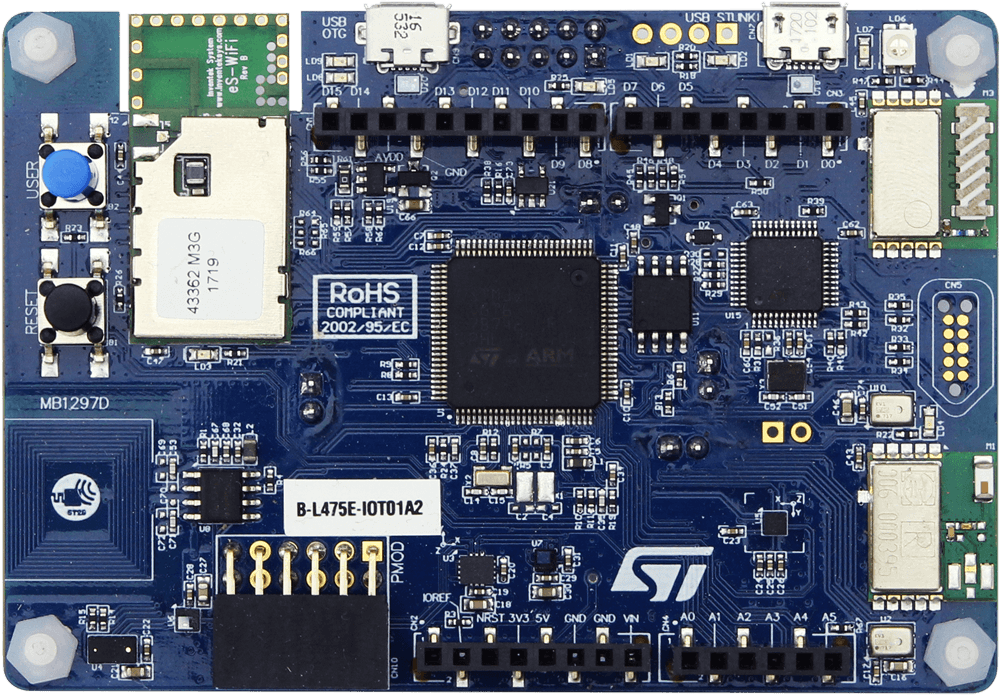
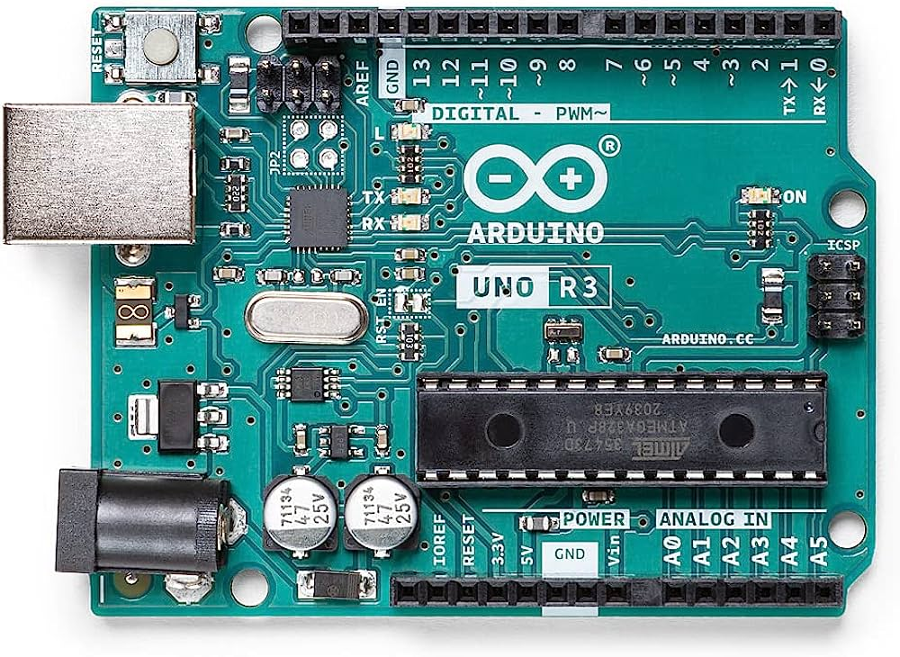
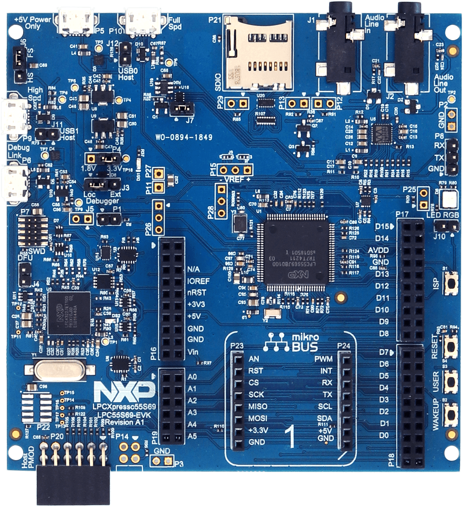

# SnowLift Tacker iot-node

## Change Log
| Version|    Date    | Edited by          | Description |
| :---   |   :----:   | :----              | :---         | 
| v1.0.0 | 10/01/2024 | LABD               | Creation |
| v1.0.0 | 15/01/2024 | LABD               | Update |

## Table of Content

[[_TOC_]]

## Overview

Welcome to the IoT Node of the SnowLift Tracker project! This component is responsible for collecting data from sensors and communicating with the IoT Gateway. In this document, you'll find information on the supported boards, how to set up and configure the IoT Node, and more.

## Supported Boards

### STM32 IoT Node

#### Board Overview

The STM32 IoT Node is a powerful microcontroller board equipped with the STM32 family chipset. Some key features include:

- **Processor:** ARM Cortex-M series
- **Connectivity:** Wi-Fi, Bluetooth Low Energy (BLE)
- **GPIO Pins:** Allows for easy sensor and peripheral connections
- **Integrated Sensors:** Some models come with built-in sensors (accelerometer, gyroscope, etc.)
- **Low Power Consumption:** Ideal for battery-powered IoT applications

#### Setup Instructions

1. **Hardware Setup:**
   - Connect the sensors to the GPIO pins based on your project requirements.
   - Utilize the integrated sensors if available.
   - Ensure power is supplied appropriately.

2. **Software Setup:**
   - Use the STM32 development environment to program the board.
   - Implement sensor drivers and communication protocols as needed.

### Arduino

#### Board Overview

Arduino boards are widely used in the maker community, offering a variety of models with different specifications. Some general features include:

- **Processor:** AVR or ARM-based, depending on the model
- **Connectivity:** Various communication options (e.g., USB, Bluetooth)
- **Extensibility:** Supports a wide range of shields for additional functionalities
- **Community Support:** Large and active community for troubleshooting and guidance

#### Setup Instructions

1. **Hardware Setup:**
   - Connect sensors using the appropriate pins on the Arduino board.
   - Utilize shields for additional features if needed.

2. **Software Setup:**
   - Use the Arduino IDE to write and upload the code to the board.
   - Implement sensor drivers and communication protocols as needed.

### NXP 55S69

#### Board Overview

The NXP 55S69 is a microcontroller board known for its robust performance and connectivity options. Key features include:

- **Processor:** ARM Cortex-M series
- **Connectivity:** Ethernet, Wi-Fi, Bluetooth
- **Integrated Security Features:** Suitable for secure IoT applications
- **Extensive Peripheral Support:** Allows for versatile sensor connections

#### Setup Instructions

1. **Hardware Setup:**
   - Connect sensors to the appropriate pins on the NXP 55S69 board.
   - Leverage integrated security features for data protection.

2. **Software Setup:**
   - Use the NXP development environment to program the board.
   - Implement sensor drivers and communication protocols as needed.

## Future Enhancements
- **Support for Arduino:** Integrate a dedicated service for Arduino boards, expanding compatibility and allowing users to leverage Arduino-based (ARM-based) solutions.
- **Support for NPX55S69:** Extend compatibility to include the NPX55S69 microcontroller board, offering users a secure and advanced option for their IoT applications.
- **Bare Metal Implementation:** Explore the development of a bare-metal version of the IoT Gateway to maintain just one code without dependending on each board IDE.


## Building Steps

1. Clone the IoT Node repository:

   ```bash
   git clone https://github.com/your-username/iot-node.git
   ```

2. Navigate to the IoT Node directory:

   ```bash
   cd iot-node
   ```

3. Implement sensor drivers and communication protocols based on the selected IoT Node.

4. Program and upload the code to the board using the respective development environment.
